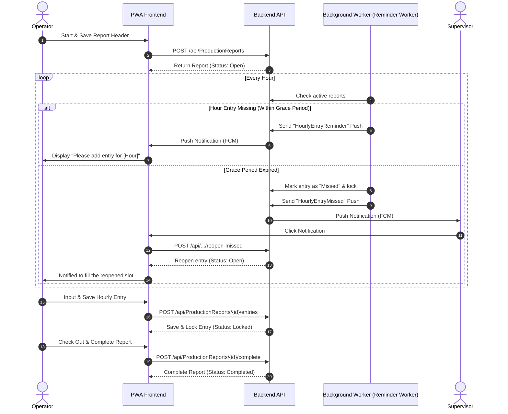

# Production Report Notification & Workflow Guide

This document provides a comprehensive guide for developers on how the notification system and the production report lifecycle work in the application. It details the end-to-end flow, from starting a report to submitting hourly entries, handling missed entries, sending notifications, and reopening/unlocking entries.

---

## 1. Overview of the Flow

The system coordinates the actions of **Operators** (who enter production data hourly) and **Supervisors/Admins** (who monitor progress and manage entries) using a background worker on the backend and a Progressive Web App (PWA) client with Firebase Cloud Messaging (FCM) on the frontend.

---

## 2. Notification Mechanics & Frequency

### 2.1 Notification Types
The system defines two main types of notifications:
1. **`HourlyEntryReminder`**: Sent to the **Operator** assigned to the report when an hourly slot remains unsubmitted.
2. **`HourlyEntryMissed`**: Sent to the **Supervisors/Admins** when the operator fails to fill an hourly slot within the allowed grace period, causing the system to auto-mark it as missed.

### 2.2 Frequency & Timing (How many times is it sent?)
The background worker (`ProductionReportReminderWorker.cs` on the backend) runs periodically—typically **every 5 to 10 minutes** (depending on configuration)—to check for active reports:

* **Grace Period**: After a production hour finishes (e.g. 08:00 - 09:00 slot ends at 09:00), the operator has a **15-minute grace period** (configured as `HourlyEntryGracePeriodMinutes` on the backend) to submit the entry.
* **First Reminder**: If the entry is not submitted by 09:15, the first `HourlyEntryReminder` notification is dispatched to the operator.
* **Subsequent Reminders (Maximum Retries)**: The worker will send up to **3 reminders** (configured via `MaxReminderCount`) spaced at **5-10 minute intervals**.
* **Transition to Missed**: If no entry is submitted after the maximum reminders or once the final timeout is reached (e.g., **30 minutes** after the slot ended), the worker:
  1. Auto-creates a dummy entry with `entryStatus = "Missed"`.
  2. Locks the entry.
  3. Dispatches a single `HourlyEntryMissed` notification to all registered supervisors/admins.

---

## 3. Client-Side (PWA) Integration & Flow

### 3.1 Device Token Registration
1. When a user logs in, the [PushNotificationService](file:///d:/HemalGithub/ShreeYogiAngineeringUI/src/app/core/services/push-notification.service.ts) initializes.
2. It requests notification permissions from the browser.
3. If granted, it fetches the FCM device token via the Firebase SDK using the VAPID key.
4. It registers this token on the backend via:
   `POST /api/Notifications/register-device`

### 3.2 Receiving a Notification
* **Background Mode**: If the app is closed/in the background, the service worker [firebase-messaging-sw.js](file:///d:/HemalGithub/ShreeYogiAngineeringUI/src/firebase-messaging-sw.js) receives the push payload and displays a native system notification.
* **Foreground Mode**: If the app is open, [PushNotificationService](file:///d:/HemalGithub/ShreeYogiAngineeringUI/src/app/core/services/push-notification.service.ts) intercept the event and shows an in-app toast message with an action button ("Open").

### 3.3 Auto-Adding Slots via Notification Link
Each notification includes a payload link pointing to the specific report, containing query parameters to automate the workflow, for example:
`/production-reports/edit/{reportId}?autoAddSlot=true&slotFrom=08:00&slotTo=09:00`

When the user clicks the notification:
1. The app routes them to [ProductionReportFormComponent](file:///d:/HemalGithub/ShreeYogiAngineeringUI/src/app/features/production-report/production-report-form/production-report-form.component.ts).
2. The component reads `autoAddSlot=true`, `slotFrom`, and `slotTo` from the route parameters.
3. It automatically inserts the new slot row into the form array so the user doesn't have to manually configure the time range.
4. The user fills in the quantities, remarks, etc., and clicks **Save & Lock**.

---

## 4. Production Report Lifecycle

### 1. Starting a Report
* **Action**: Operator or Admin creates the header.
* **Fields**: `reportDate`, `shiftName`, `machineType`, `machineName`, `customer`, `item`, `operator`, and `operatorInTime` (Check In).
* **API**: `POST /api/ProductionReports`
* **Status**: `Open`

### 2. Adding & Saving Hourly Entries
* **Action**: Operator inputs `okQuantity`, `rejectedQuantity`, `rejectReason` (if any), and `remarks` for each hour of the shift.
* **API**: `POST /api/ProductionReports/{correlationId}/entries`
* **Locking**: Once saved, the entry status becomes `Locked`. The operator cannot edit locked entries.
* **Validation**: The slot must lie within the operator's active shift time (between `operatorInTime` and `operatorOutTime`).

### 3. Handling Missed Entries
* **Action**: Triggered automatically by the backend worker.
* **Result**: The missing slot is added with status `Missed` and is immediately locked.
* **Reopening**: An Admin/Supervisor can click **Reopen** in the form to unlock this slot.
* **API for Reopen**: `POST /api/ProductionReports/{correlationId}/entries/{entryCorrelationId}/reopen-missed`
* **Result of Reopen**: The entry is unlocked, and the operator can now fill and save the correct data.

### 4. Completing the Report
* **Action**: Operator checks out by setting the `operatorOutTime` and clicks **Complete Report**.
* **API**: `POST /api/ProductionReports/{correlationId}/complete`
* **Status**: `Completed`.
* **Locking**: All header fields and all entries are permanently locked and cannot be edited.

---

## 5. API Reference Summary

### For Notifications:
* `GET /api/Notifications` - Retrieve notifications for the authenticated user.
* `GET /api/Notifications/unread-count` - Get the count of unread notifications.
* `POST /api/Notifications/{correlationId}/read` - Mark a specific notification as read.
* `POST /api/Notifications/read-all` - Mark all notifications as read.
* `POST /api/Notifications/register-device` - Register the client's FCM token.
* `POST /api/Notifications/unregister-device` - Unregister the device token (e.g. on logout).

### For Production Reports & Entries:
* `POST /api/ProductionReports` - Create a new report header.
* `PUT /api/ProductionReports/{correlationId}` - Update the report header (Admin only).
* `POST /api/ProductionReports/{correlationId}/entries` - Save/Lock a manual hourly entry.
* `POST /api/ProductionReports/{correlationId}/entries/{entryCorrelationId}/unlock` - Unlock a locked entry (Admin only).
* `POST /api/ProductionReports/{correlationId}/entries/{entryCorrelationId}/reopen-missed` - Reopen a missed entry (Admin only).
* `POST /api/ProductionReports/{correlationId}/complete` - Finalize the report (sets status to `Completed`).
